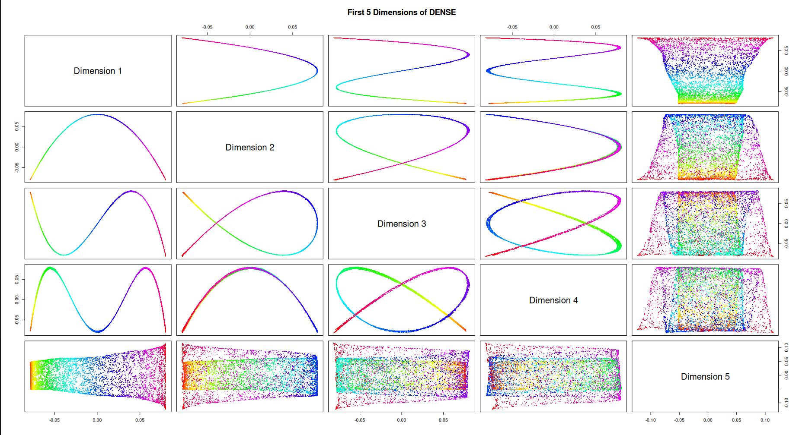
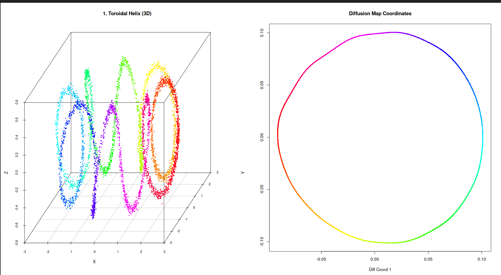

# Overview of cDiffusion

## How Diffusion Maps Work

Diffusion Maps are a non-linear dimensionality reduction technique.
While methods like PCA assume data lies on a flat, linear plane,
Diffusion Maps are designed to uncover complex, folded structures
(manifolds) by simulating a random walk (a Markov chain) over the data
points.

The core algorithm consists of three mathematical steps:

1.  **Kernel Construction (Affinity Matrix):** We calculate the
    distances between data points and apply a Gaussian kernel to convert
    these distances into affinities (similarities). Points that are
    close together get an affinity near 1.0, and points far away drop to
    0.0.
    - **Dense Method:** Calculates distances between all possible pairs
      of points using a single global sigma.
    - **Sparse Method:** Builds a k-Nearest Neighbors (k-NN) graph. It
      only connects a point to its closest neighbors using an adaptive,
      local sigma. This forces the algorithm to “walk” strictly along
      the shape of the data.
2.  **Markov Normalization:** The affinity matrix is normalized by its
    row sums. This transforms the matrix into a set of transition
    probabilities, representing the chance of “jumping” from one point
    to another in a single step of a random walk.
3.  **Eigendecomposition:** We calculate the eigenvalues and
    eigenvectors of this transition matrix using a fast Randomized SVD
    (rSVD) solver. The first non-trivial eigenvectors form the new,
    reduced coordinates that represent the underlying geometry of the
    dataset.

------------------------------------------------------------------------

## 1. Harmonics of Diffusion Maps (The Swiss Roll)

When dealing with a continuous 1D manifold rolled up in a 3D space (like
a Swiss Roll), the resulting diffusion dimensions represent subsequent
harmonic functions (cosine waves of increasing frequencies).

Plotting these dimensions against each other produces different curves
(parabolas, waves, and figure-eights). The last dimension finally
captures the “width” of the unrolled sheet.

``` r

library(scatterplot3d)
library(cDiffusion)

set.seed(67)
N <- 7000
t <- runif(N, min = 1.5 * pi, max = 4.5 * pi)
t <- sort(t) 
h <- runif(N, min = 0, max = 20)

X <- t * cos(t) + rnorm(N, sd=0.3)
Y <- h
Z <- t * sin(t) + rnorm(N, sd=0.3)
swiss_data <- cbind(X, Y, Z)

colors <- rainbow(N)

model_swiss_dense <- run_diffusion(swiss_data, dims = 5, n_iter = 100)

coords_3d <- model_swiss_dense$coordinates[, 1:5]

par(mfrow=c(1, 1), mar=c(4, 4, 4, 1))

pairs(coords_3d, 
      col = colors, 
      pch = 16, 
      cex = 0.4, 
      labels = c("Dimension 1", "Dimension 2", "Dimension 3", "Dimension 4", "Dimension 5"),
      main = "First 5 Dimensions of DENSE") 
```



Swiss roll unrolled

------------------------------------------------------------------------

## 2. Unrolling a Toroidal Helix

A Toroidal Helix is a complex 3D shape representing a coiled spring
wrapped around a torus. Because it relies on non-uniform sampling, it is
an extremely difficult shape for traditional reduction methods.

Using the sparse k-NN approach, cDiffusion easily discovers the
underlying primary cycle of the manifold, unrolling the complex 3D knot
into a perfect 2D circle.

``` r

library(scatterplot3d)
library(cDiffusion)

set.seed(67)
N_points <- 5000
R <- 2   
r <- 0.6  
omega <- 8 

u <- rbeta(N_points, 0.7, 0.7) 
t <- sort(u * 2 * pi) 

phi <- t
theta <- omega * t

X_t <- (R + r * cos(theta)) * cos(phi) + rnorm(N_points, sd=0.03)
Y_t <- (R + r * cos(theta)) * sin(phi) + rnorm(N_points, sd=0.03)
Z_t <- r * sin(theta) + rnorm(N_points, sd=0.03)
helix_data <- cbind(X_t, Y_t, Z_t)

helix_colors <- hsv(phi / (2*pi), 1, 1)

par(mfrow=c(1,2), mar=c(2,2,2,1))
scatterplot3d(helix_data, color = helix_colors, pch = 16, cex.symbols = 0.5,
              main = "1. Toroidal Helix (3D)", angle = 60,
              xlab = "X", ylab = "Y", zlab = "Z")

model_helix <- run_diffusion_sparse(helix_data, dims = 5, k_neighbors = 35, n_iter = 1000, oversampling = 20)

coords <- model_helix$coordinates 

plot(coords[,1], coords[,2], 
     col = helix_colors, pch = 16, cex = 0.6,
     main = "Diffusion Map Coordinates", 
     xlab = "Diff Coord 1", ylab = "Diff Coord 2")
```



Toroidal Helix Unrolled
